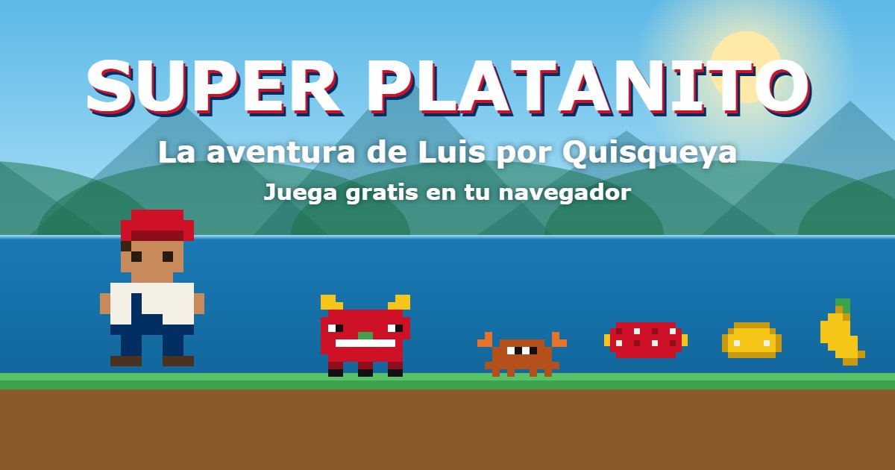
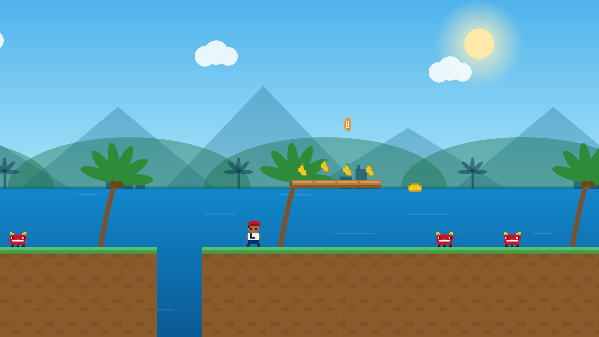
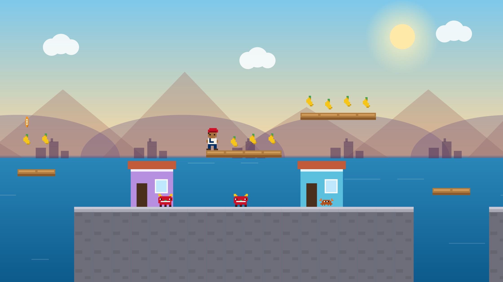
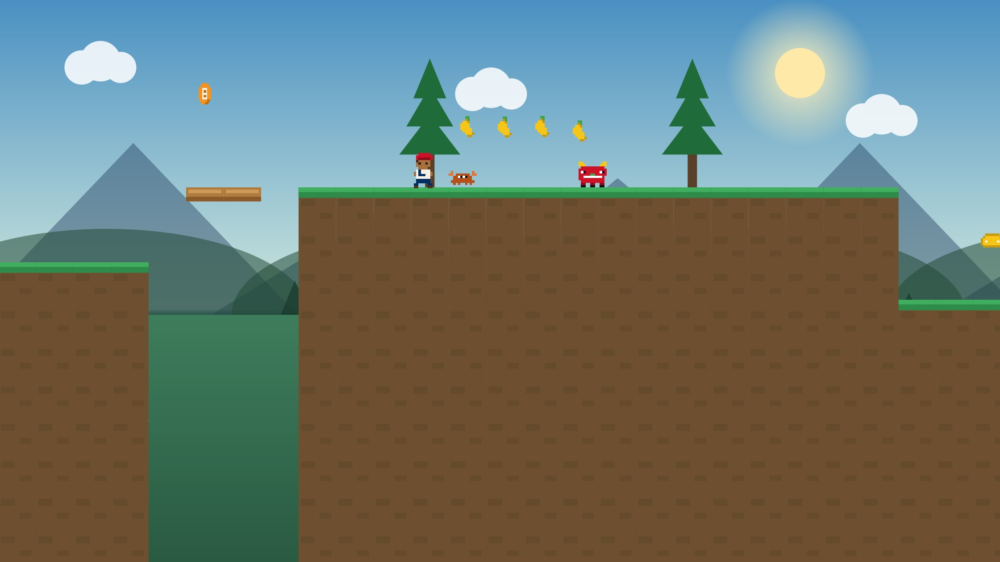

# 🍌 Super Platanito

**La aventura de Luis por Quisqueya** — a Dominican Republic-themed platformer that runs in any browser, built for mobile.

### ▶️ [**PLAY NOW → agentmrbig.github.io/super-platanito**](https://agentmrbig.github.io/super-platanito/)

No install, no account. Works on iPhone, Android, and desktop. Share the link — it unfurls with a proper game card in WhatsApp.

## The game

Help **Luis** run, jump, and stomp his way across three levels of the Dominican Republic — from the Malecón of Santo Domingo, through the Zona Colonial, up to the mountains — collecting plátanos and dodging **Diablos Cojuelos** on the way to the colmado.

Classic Super Mario Bros.–style physics: momentum, skidding, variable-height jumps (hold to jump higher), coyote time, and the timeless stomp.

## Two ways to play

| Mode | Controls |
|---|---|
| 🎮 **Clásico** | ◀ ▶ + SALTA buttons on touch, or arrow keys / WASD + Space on desktop. Throw queso with the 🧀 button or `X`. |
| 🏃 **Corredor** | Luis runs by himself — tap to jump, hold for a higher jump. One thumb. Queso auto-throws. |

## The levels

### Nivel 1 · Santo Domingo — El Malecón
Ocean views, palm trees, and the city skyline behind you. A gentle start.

### Nivel 2 · Zona Colonial
Sunset over cobblestone streets and pastel colonial houses. More Diablos, tighter jumps, rooftop plank routes.

### Nivel 3 · La Montaña
Terraced climbs to a summit ridge, pine trees, and the hardest gaps in the game.

Beat a level and the next one starts automatically — lives, plátanos, and power-ups carry over. The menu has a level picker if your friends want to skip straight to the mountain and get humbled.

## Power-ups — los tres golpes 🇩🇴

| Item | Effect |
|---|---|
| 🥩 **Salami** | Luis grows and can take one hit (shrinks back instead of dying) |
| 🧀 **Queso frito** | Throw sizzling cheese wedges that bounce along the ground and take out enemies |
| ₿ **Bitcoin** | 3 per level, always in the risky spots. Separate counter. Do you dare? |

Getting hit walks you back down the food chain: queso → salami → small → 💀. Colmaditos are checkpoints; the Dominican flag marks the goal.

## Tech

One self-contained `index.html` — no frameworks, no build step, no image assets. Everything is drawn on a `<canvas>`: pixel-art sprites generated from string maps, parallax skylines, even the WhatsApp share card was rendered by the game itself. Physics runs at a fixed-feel 60fps with proper SMB1-style tuning.

Background music lives in [`bg_music/`](bg_music/) — two tracks alternate, with a 🔊 mute toggle in the HUD.

## Credits

- Game design & code: built live with **Claude** (Anthropic)
- Music: E&V Industries
- Inspiration: Super Mario Bros. (1985) and the Dominican Republic 🇩🇴

*¡Recoge todos los plátanos!* 🍌
